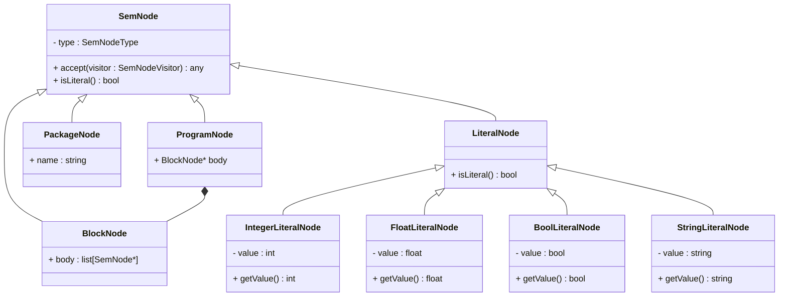

```mermaid
classDiagram
    %% 所有类的基类
    class SemNode{
        - type : SemNodeType
        + accept(visitor : SemNodeVisitor) any
        + isLiteral() bool
    }
    
    class BlockNode{
        + body : list[SemNode*]
    }
    
    SemNode <|-- BlockNode 
    
    class ProgramNode{
        + BlockNode* body
    }
    
    SemNode <|-- ProgramNode
    ProgramNode *-- BlockNode
    
    class PackageNode{
        + name : string
    }
    
    SemNode <|-- PackageNode
    
    class LiteralNode{
        + isLiteral() bool
    }
    
    SemNode <|-- LiteralNode
    
    class IntegerLiteralNode{
        - value : int
        + getValue() int
    }
    
    LiteralNode <|-- IntegerLiteralNode
    
    class FloatLiteralNode{
        - value : float
        + getValue() float
    }

    LiteralNode <|-- FloatLiteralNode
    
    class BoolLiteralNode{
        - value : bool
        + getValue() bool
    }

    LiteralNode <|-- BoolLiteralNode
    
    class StringLiteralNode{
        - value : string
        + getValue() string
    }
    
    LiteralNode <|-- StringLiteralNode
```